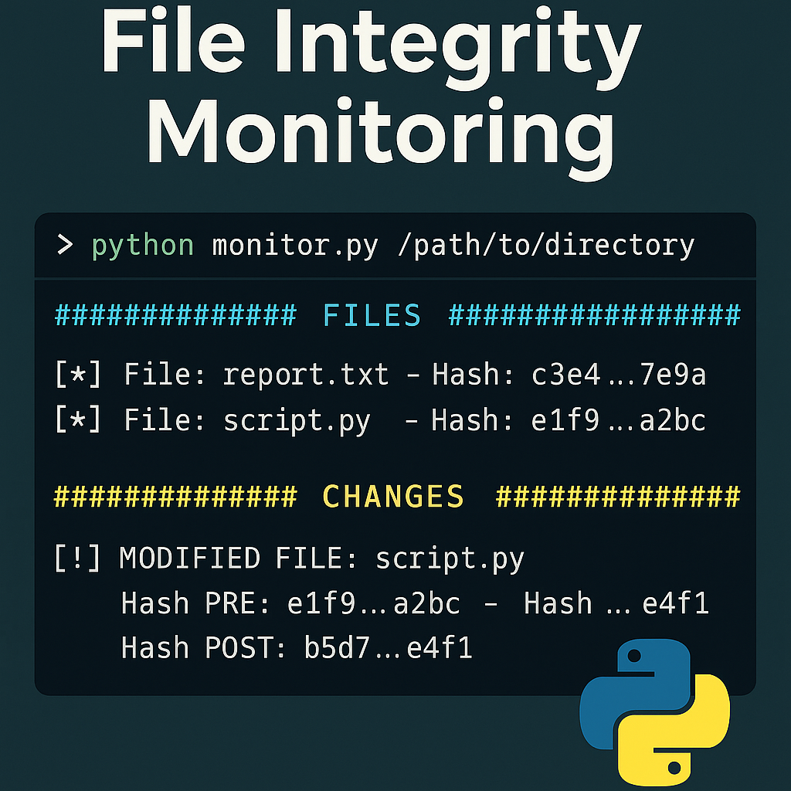
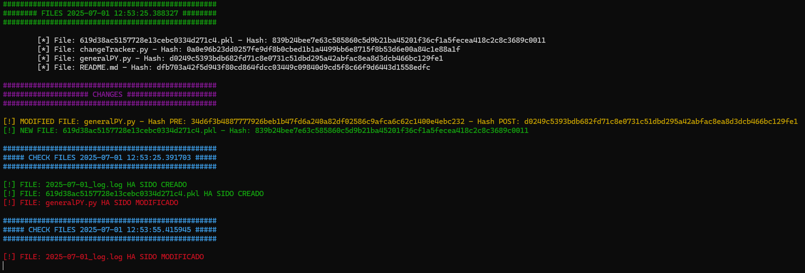

# 🔐 Control de Integridad de Archivos en Python



Este proyecto en Python permite monitorizar de forma periódica un directorio específico para detectar cualquier modificación, eliminación o creación de archivos. Es ideal para fines de auditoría, análisis forense, o simplemente para asegurarte de que tus archivos críticos no han sido alterados sin tu conocimiento.

## 📦 Características

- 🧠 Detección inteligente de archivos:
  - Modificados
  - Eliminados
  - Nuevos
- 🗃️ Almacenamiento persistente del estado del directorio (usando `pickle`)
- 🧾 Logs detallados y coloreados en consola
- ⏱️ Monitoreo continuo con intervalo personalizable (por defecto: cada 30 segundos)
- 💥 Manejo de interrupciones (`Ctrl+C`) para guardar el estado antes de salir

## 🛠️ Requisitos

- Python 3.6+
- Sistema Unix (se ha desarrollado y probado en Kali Linux)
- Módulo personalizado `generalPY.py` (incluye funciones auxiliares como logs y colores)

## 🧪 Instalación

1. Clona el repositorio:
   ```bash
   git clone https://github.com/tu-usuario/control-de-integridad.git
   cd control-de-integridad
```

2. Asegúrate de tener el archivo generalPY.py en el mismo directorio (o instálalo como módulo si es propio).

3. Ejecuta el script con la ruta que deseas monitorizar:
   ```bash
   python3 monitor.py /ruta/a/tu/directorio
```

## 📁 ¿Qué guarda?

- Los hashes SHA256 de todos los archivos en el directorio monitorizado.
- Cambios detectados en un archivo .pkl en /home/kali/Documents/controlerData/ (puedes cambiar esta ruta).
- Logs con colores y mensajes en terminal.

## 💡 Ejemplo de salida



## ✋ Interrupción segura

Al presionar Ctrl+C, el programa:

- Guarda automáticamente el estado actual
- Finaliza de forma segura

## 📌 Personalización

Puedes adaptar:

- El algoritmo de hash (sha256 por defecto)
- El intervalo de tiempo (time.sleep(30))
- La ubicación del archivo .pkl
- La lógica de impresión/modificación en generalPY.py

## 📜 Licencia

MIT License. Puedes usarlo, modificarlo y distribuirlo libremente.

## 🤝 Contribuciones

¡Toda contribución es bienvenida! Puedes enviar pull requests o abrir issues para mejoras, ideas o reportes de bugs.

## 🧑‍💻 Autor
Desarrollado por [Alejandro Molinos Eligio](https://github.com/AlejandroMolinosEligio)
